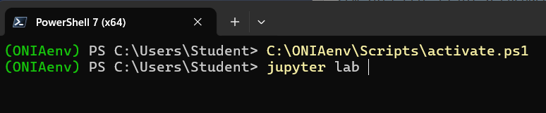
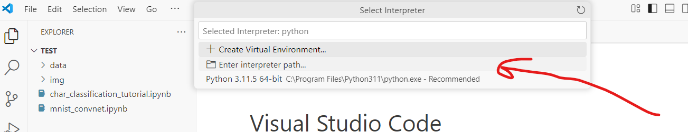

# OlimpiadaAI - Instalator Windows 
(in mare parte compatibil si cu Mac/Ubuntu; todo next)

Acest proiect automatizează instalarea și verificarea completă a unui mediu Python pentru inteligență artificială, procesare de date și competiții educaționale.

---


## Testare
- Folderul **Test** din acest repository contine doua notebook-uri de test pentru a asigura instalarea complete si folosirea venv-ului de python instalat local in **C:\ONIAenv** (daca nu este in aceasta locatie urmati pasii de mai jos din **Instalare completa** pentru ca PC-ul nu este configurat)
- Cele doua notebook-uri trec prin librariile de datasets, keras, pytorch, vizand o problema de NLP si una de CV.
- Pentru testare downloadati repo-ul prima oara

  ### 1. Activare environment *ONIAenv*:
  - Daca folosesti CMD: ```C:\ONIAenv\Scripts\activate```
  - Daca folosesti Powershell ```C:\ONIAenv\Scripts\activate.ps1```

    
    

    Vei sti daca s-a activat corect prin prefixul *(ONIAenv)* pus in fata, ca in poze.
    
  ### 2.Folosire cu **jupyter lab**
   - ruleaza ```jupyter lab``` din terminalul activat la pasul 1.
   - Se va deschide apoi un jupyter lab in browser ca in poza de mai jos. Ruleaza cu Run all toate celulele din notebook-uri si asigurate ca nu sunt erori.
     

  ### 2. Activate si folosire cu **VS code** 
   2.1 Din acest terminalul activat la pasul 1 deschide VSCode folosind comanda ```code```.
   2.2 **File -> OpenFolder -> path/to/Test**
  
   2.3 **Selectati kernelul de ONIAenv** - necesar **DOAR** daca ai mai facut acesti pasi anterior sau ai probleme cu importul pachetelor**
     - Apasa SHIFT + CTRL + P si alege **Python: select interpreter** ca in poza de mai jos:
     - 
       
       
     - Alege **Enter interpreter path**:
     - 
       
       
     - Pune destinatia venv-ului: **C:\ONIAenv\Scripts\python.exe**
       
       
       
     - Deschide unul din notebook-uri sau propriul tau cod de python.
       Ca sa selectezi kernel-ul configurat anterior, urmati pasii 1,2,3,4 ca in pozele de mai jos.
       (Atentie poate fi deja un *Python3.11.5* selectat default ca in poza de mai jos, ori poate scrie generic *Select Kernel*)
       
       
       
       
       
       
  
  2.4  Ruleaza notebook-urile ambele cu iconita de **Run All** ca in poza de mai jos si asigurate ca nu sunt erori.
       Nota: Cu verde, am macat cum ar trebui sa arate configuratia corecta a kernelului curent. Daca nu este corect, reluati pasul 2.3
  
       

---
## 🔄 Instalare completă
- Cloneaza sau downloadeaza acest repository (Click pe butonul verde Code -> Download ZIP)
- Deschide un terminal PowerShell/CMD în acest folder ca administrator

- **0. Verifica existenta unui python instalat**  cu o comanda ```python --version``` in terminal. Daca nu e gasit treci la **1**, altefel sari la **2**.
- **1. DOAR DACA nu ai nici o versiune de Python comanda precedenta esueaza  - (exemplu lab 204 FMI sau EDIS din afara facultatii; la FMI majoritatea au deja):
- ```install_python.bat``` din terminal pentru instalare Python 3.11.5.
   ** INCHIDE TERMINALUL DUPA ACEST PAS si deschide altul pentru continuare, tot ca admin **

- **2. Verifica existenta unui VSCode** cu o comanda ```code``` in termina. Daca se deschide, insteamna ca poti sa sari la pasul **4**.
- **3** ```install_vscode.bat``` din termina pentru instalare VSCode (nu este nevoie sa inchizi terminalul)
- **4**
     - **Nota:** In caz ca ai alta versiune de python decat 3.11.5 (spre exemplu multe calculatoare din FMI au 3.13 instalat, ti se va cere acordul sa instaleze 3.11.5, ca in poza de mai jos. Va trebui insa sa inchideti terminalul, asa cum scrie in mesaj si sa redeschideti tot ca administrator.

```
[2025-05-14 15:30:57] [ERROR] Versiunea Python 3.11.5 este necesară. Detectat: 3.13.1
❓ Vrei să instalăm automat Python 3.11.5 acum? [y/n]: y
[2025-05-14 15:31:01] [INFO] Descărcare installer Python 3.11.5...
[2025-05-14 15:31:09] [OK] Installer descărcat.
[2025-05-14 15:31:09] [INFO] Instalare Python 3.11.5 în mod silențios...
[2025-05-14 15:31:32] [OK] Python 3.11.5 instalat.
[2025-05-14 15:31:32] [INFO] Vă rugăm să închideți și să redeschideți terminalul înainte de a continua.
PS C:\Users\Student\Installers-main> python .\setupONIAenv.py
```

  - **Ruleaza** ```install_packages.bat``` pentru instalarea packaetelor, extensiilor de VSCode, verificarea instalarii si a compatatibilitatii intre pachete. Urmareste sa nu apara erori cu culoare rosie si sa dea [OK] la final.
    
  
  - Pentru dezintalare sau reluarea procesului in caz de eroare:
  ```
  python setupONIAenv.py --clean
  ```


##  Activarea mediului

Rulează:


```
start_onia_env.cmd
```
TODO: ar fi bine sa punem o poza cum se foloseste si din VSCode.


## Detalii tehnice (optionale):

Scriptul va:

1. Crea mediul virtual `C:\ONIAenv`
2. Instala toate pachetele din `requirements_3.txt`
3. Descărca toate datele NLTK
4. Păstra jurnalul în `install_log.txt`
5. Testa importurile și Jupyter Lab
6. Configura variabila `TF_ENABLE_ONEDNN_OPTS=0` pentru TensorFlow
7. Instaleaza plugin-ul de jupyter pentru VSCode.
---

Acesta va:

- Activează mediul virtual `C:\ONIAenv`
- Setează variabila `TF_ENABLE_ONEDNN_OPTS=0`
- Deschide un nou terminal activat

- Dacă TensorFlow afișează avertismente legate de oneDNN, acestea sunt gestionate automat.
- Toate acțiunile sunt salvate în `install_log.txt` pentru depanare.

### 📁 Fișiere incluse

| Fișier                       | Descriere                                                                 |
|------------------------------|---------------------------------------------------------------------------|
| `setupONIAenv.py`            | Script Python care instalează mediul virtual și pachetele necesare        |
| `requirements_3.txt`         | Lista tuturor pachetelor Python necesare                                  |
| `packages_to_check.py`       | Script de test pentru importul pachetelor                                 |
| `start_onia_env.cmd`         | Script CMD pentru activarea rapidă a mediului și setarea variabilelor     |
| `install_oni_utils.bat`      | Script pentru instalare python 3.11.5 si VSCode                           |


  2. Activare si folosire cu VSCode 
---

© ONIA 2025 · Utilizare educațională · Universitatea din București 🇷🇴
